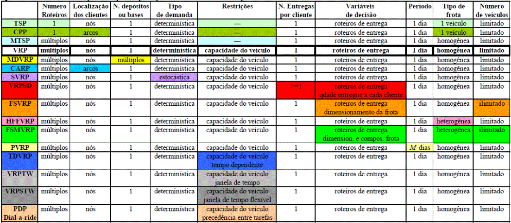
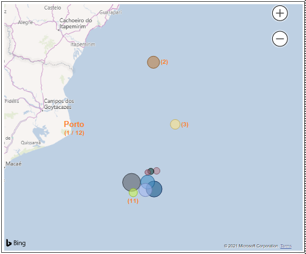
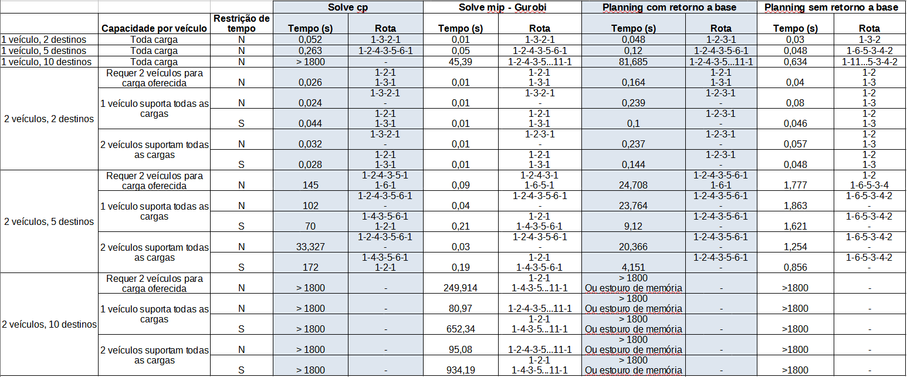

# __Roteirização em logística com Planner e Solve na linguagem PICAT__

#### Alun(o/a): [Renato Faustino](https://github.com/link_do_github).
#### Orientador(/a/es/as): [Anderson Silva do Nascimento](https://github.com/link_do_github).

---

Trabalho apresentado ao curso [BI MASTER](https://ica.puc-rio.ai/bi-master) como pré-requisito para conclusão de curso e obtenção de crédito na disciplina "Projetos de Sistemas Inteligentes de Apoio à Decisão".

- [Link para o código].

https://github.com/renatofmsg/Roteirizar-com-Planner-e-Solve-na-linguagem-PICAT/blob/main/Algoritmo_Logistica_Planner.pi

https://github.com/renatofmsg/Roteirizar-com-Planner-e-Solve-na-linguagem-PICAT/blob/main/Algoritmo_Logistica_Solver.pi

### - Trabalhos relacionados: 

    - [1] ARPINI, BIANCA PASSOS, Planejamento da logística de suprimento de plataformas offshore por meio de um modelo matemático 2L-CVRP com frota heterogênea e equilíbrio náutico, Universidade Federal do Espírito Santo, 2015 

    - [2] GONÇALVES, RÔMULO PARMA, Uso de algoritmo genético para otimização de rota de embarcação em atendimento a serviços offshore da indústria de óleo e gás, Pontifícia Universidade Católica do Rio de Janeiro, 2020 

    - [3] LOBATO, PEDRO TEIXEIRA CARDOSO, Revisão de Sistema de Medição de Desempenho: Pesquisa-Ação no Caso da Logística da Exploração e Produção de Petróleo, Pontifícia Universidade Católica do Rio de Janeiro, 2014 

    - [4] MARCELLINO, FELLIPE FERNANDES CARDOSO, Roteirização de entregas para uma Startup do setor de alimentação saudável, Universidade de São Paulo, 2017
    - [5] ZHOU, NENG-FA and FRUHMAN, JONATHAN, A User´s Guide to Picat, http://picat-lang.org/download/picat_guide.pdf 

    - [6] ZHOU, NENG-FA; FRUHMAN, JONATHAN and KJELLERSTRAND, HAKAN, Constraint Solving and Planning with Picat, http://picat-lang.org/picatbook2015.html 

---

### __Resumo__

*Neste trabalho utilizamos a linguagem de programação Picat em alguns cenários de logística, sendo que o objetivo principal é apresentar o tempo para o cálculo da roteirização de veículos utilizando as funções Solve e Planner, disponíveis na linguagem. Como os problemas de roteirização são caracterizados por ter alta complexidade computacional e utilizamos um computador pessoal para simular diferentes cenários restringimos a abrangência dos mesmos, porém visando ter resultados que possibilitem ter uma boa percepção do desempenho de cada função. Descrevemos as possibilidades de uso da função Solve e apresentamos os resultados obtidos utilizando algumas bibliotecas. Também apresentamos os resultados da função Planner por se esperar um bom resultado da mesma, pois pode ser utilizado tabelas para análise, que tem boa relação com roteirização. As funções foram utilizadas variando alguns fatores visando analisar a sensibilidade de cada alternativa em função das restrições apresentadas para o problema.*

Palavras Chave: Logística, Roteirização, Heurística, Pesquisa operacional, Programação lógica, Picat

### __Abstract__

*In this work it is used the Picat programming language in some scenarios of logistic, where the main subject is present the time to obtain the result of routing by using Solve and Planner functions, available in the language. As the routing problems are known to have high processing complexity and we used one personal computer to the simulation, it was necessary reduce the sceneries complexity, however trying to results that allow to have a good perception of the performance of each function. We describe the possibilities of adopt the Solve function and present results by using some libraries. We too present the Planner function expecting a good result, because use tables for the analyse, that has relationship with routing. The functions were adopted with variation of some factors to have the sensibility of each alternative according to restrictions of the problem.*

### __Motivação e cenários utilizados na análise__

A preocupação com a roteirização de veículos vem crescendo nas últimas décadas, principalmente pela sua aplicabilidade na logística empresarial. Estima-se que os custos de transporte representam de 1/3 a 2/3 dos custos logísticos de uma empresa [4]. Através de investimentos e estudos nesta área, é possível obter economia de tempo e custo, aumentando a qualidade do serviço e as margens operacionais das empresas e da cadeia de suprimentos como um todo.

O problema de roteirização de veículos pode ser considerado uma extensão do conhecido Problema do Caixeiro Viajante (PCV), com restrições adicionais de capacidade dos veículos e demandas dos clientes. Trata-se de uma categoria ampla de problemas de pesquisa operacional conhecida como problema de fluxo em redes. Também são encontrados nessa categoria os problemas clássicos de fluxo máximo, de caminho mínimo, de transporte e de designação, além de outros. Como pode ser observado na tabela 1, há diversas variações de soluções exploradas para o PCV [4].

As operações de exploração marítima offshore podem ser caracterizadas como operações de frota industrial, sendo comum a ocorrência de problemas de roteirização e programação de navios visando a minimização de custos operacionais ou maximização de receitas advindas dos serviços realizados por esta frota no horizonte de curto e médio prazo em que estes problemas estão inseridos.

O objetivo desse trabalho é realizar a roteirização de veículos (embarcações) que atenderão até 10 plataformas de produção de petróleo no ambiente offshore partindo de um porto. A disposição do porto e das plataformas são apresentados na figura 1. Para se ter uma ideia das distâncias envolvidas, a distância entre o porto a plataforma com o índice (2) é de 125 km.

Tabela 1 - Variações do PCV

O objetivo desse trabalho é realizar a roteirização de veículos (embarcações) que atenderão até 10 plataformas de produção de petróleo no ambiente offshore partindo de um porto, a disposição das plataformas é apresentada na Figura 1.

Simularemos a mobilização de até 2 veículos com diferentes capacidades de carga variando o total de plataformas a serem atendidas, 2, 5 e 10. Vamos definir diferentes demandas para os destinos variando desde a possibilidade de serem atendidas por um único veículo até a necessidade de mobilização dos dois, também será inserido limite de tempo para cumprir a rota total. Dessa forma os algoritmos definirão a quantidade de veículos e a melhor rota em função de suas capacidades de carga e limite de tempo para o cumprimento da rota.

Selecionamos a linguagem de programação Picat [5] para implementação dos algoritmos por essa ter mecanismos adequados para resolver problemas complexos.

Figura 1 - Mapa com os destinos

### __A linguagem de programação Picat__

Muitos sistemas complexos com aplicações em diferentes áreas requerem soluções de alta qualidade para problemas combinatórios. A programação linear e suas extensões foram desenvolvidas em pesquisa operacional uma vez formulado o paradigma principal para resolver os problemas. Nas últimas três décadas, uma abundância de paradigmas tem sido desenvolvida para resolver problemas dessa natureza, incluindo programação por restrições (*constraint programming* - CP), teste de satisfação propositória (*propositional satisfiability testing* - SAT), módulo de teorias de satisfação (*satisfiability modulo theories* - SMT), programação baseada em conjunto de respostas (*answer set programming* - ASP), programação lógica por tabela, e planejamento de busca por heurística [6].

Picat é uma nova linguagem de programação baseada em lógica multi paradigma que integra programação lógica, programação dinâmica com tabelas, e *scripts*. Também fornece facilidades para resolver problemas de busca combinatória, incluindo módulos de solver baseados em CP, SAT, SMT e MIP (mixed integer programming), além de um módulo de planejamento (planning) que pode ser implementado utilizando tabela.

Cada módulo possui diferentes pontos fortes e fraquezas. O módulo CP tende a ser a melhor escolha para problemas de restrições globais e/ou problemas específicos de estratégia. O módulo SAT normalmente é adequado para problemas que possam ser representados por expressões booleanas ou que tenha codificação CNF (Conjunctive Normal Form). O módulo MIP é a melhor escolha para muitos tipos de problemas de pesquisa operacional. Normalmente é instrutivo testar as alternativas para o mesmo problema. A linguagem oferece uma interface comum que permita uma comutação simples entre os módulos.

Todos módulos implementam o mesmo conjunto de restrições para variáveis inteiras, enquanto o módulo MIP também suporta variáveis reais. Para utilizar o solver primeiro é preciso importar o módulo. Para possibilitar utilizar a codificação de um módulo disponível no interpretador da linguagem, é possível utilizar o comando import para importar o módulo. O módulo MIP requer a adoção do Gurobi (http://www.gurobi.com/), Cbc (https://github.com/coin-or/Cbc), ou GLPK (https://www.gnu.org/software/glpk/). O modulo SMT requer o Z3 (https://github.com/Z3Prover/z3/) ou CVC4 (https://cvc4.github.io/). O usuário pode especificar em uma opção do solver que módulo será usado, se MIP ou SMT. Para maiores detalhes da linguagem consulte a referência [5].

### __Resultados obtidos__

Apresentamos na tabela 2 os resultados dos tempos de convergências e rotas indicadas com os seguintes módulos:
- *Solve* utilizando o módulo CP, disponível de forma nativa na biblioteca Picat;
- *Solve* utilizando o módulo MIP, nesse caso foi utilizada a biblioteca Gurobi, reconhecida como uma das mais eficientes para soluções multi paradigma; e
- *Planning* utilizando tabela, disponível de forma nativa na biblioteca Picat.

Não simulamos todos os módulos e algoritmos possíveis porque o objetivo principal deste trabalho foi apresentar o potencial da linguagem utilizando algumas alternativas e as diferenças entre as mesmas.

Definimos os cenários de forma a cumprir até 10 (dez) destinos visando abranger situações práticas que podem ser encontradas com certa facilidade. Restringimos o tempo de convergência a 1.800 segundos (30 minutos) por uma questão de ordem, em que se espera uma resposta relativamente rápida para necessidades de definição de rotas.

Os resultados foram obtidos utilizando um notebook com processador Intel Core i7 de 7ª geração (i7-7500U) de 2,70GHz, sistema operacional base Windows 10 64 bits, sendo que a simulação foi implementada em máquina virtual com sistema operacional Linux Ubuntu 64 bits com 2 core e 8GB de memória RAM alocados.

O notebook possui placa de vídeo Geforce 940MX com 4GB de memória, porém tal recurso não foi explorado pelos algoritmos, mesmo em etapas de teste em que os algoritmos foram executados diretamente no sistema operacional Windows.

O aumento de variáveis do problema, traduzida pelo maior número de destinos associado ao aumento do número de veículos, aumentou a complexidade da solução e restringiu as alternativas com desempenho satisfatório.

Os resultados indicaram o melhor desempenho para o módulo MIP com o algoritmo *Gurobi* instanciado, uma vez que sua implementação é uma das melhores para o problema que estamos tratando. A implementação foi capaz de tratar tanto as restrições de tempo de cumprimento da roteirização quanto as limitações de carga por veículo. Durante a execução observamos que o algoritmo explora as CPUs disponíveis, o recurso de multi tarefas e a ocupação de memória RAM foi constante.

Por outro lado, esperávamos um melhor desempenho para o algoritmo planner por ser uma referência positiva encontrada na literatura, porém para os cenários traçados se mostraram menos satisfatórios. Visando uma melhor percepção de seu potencial, reduzimos a complexidade do problema desconsiderando o retorno a origem ao final da rota, mas ainda assim teve um desempenho inferior ao MIP. A implementação não foi capaz de tratar as restrições de tempo de cumprimento da roteirização, pois a solução sempre busca o valor ótimo do tempo total, que só é cumprido mobilizando um veículo. Durante a execução observamos que o algoritmo explora as CPUs disponíveis, as multi tarefas do processador e a ocupação de memória RAM teve crescimento gradual proporcional a complexidade do problema. Em situações mais complexas o algoritmo foi interrompido por não ter mais memória disponível para atingir a convergência.

Como esperado, o algoritmo CP, que utiliza como base algoritmo genético baseado em programação linear, não se mostrou eficiente com o aumento da complexidade do problema.

Tabela 2 - Resultados obtidos

### __Conclusões__

O uso da linguagem de programação Picat se mostrou adequada para resolver problemas de roteirização, pois foi implementada nativamente para resolver problemas dessa natureza, além de permitir uma quantidade de linhas de código reduzida.

Como a roteirização é caracterizada por alta complexidade computacional, foi utilizado um computador pessoal e esperávamos respostas relativamente rápidas para obter a convergência dos algoritmos, restringimos os cenários de análise.

Como esperado, o melhor desempenho foi obtido com o módulo otimizado para o tipo de problema, no caso o MIP e associado ao algoritmo Gurobi e que explora bem o multiprocessamento.

Já o Solve no módulo CP e o Planner não se mostraram adequados para os cenários simulados principalmente por não suportarem processamento em paralelo.

---

Matrícula: 192.671.161

Pontifícia Universidade Católica do Rio de Janeiro

Curso de Pós Graduação *Business Intelligence Master*
